# Event-Driven Corporate Catalyst & Market Microstructure Engine

[](https://www.python.org/downloads/)
[](https://fastapi.tiangolo.com/)
[](https://www.sqlite.org/)
[](https://docs.pydantic.dev/)
[]()
[](LICENSE)

An institutional-grade, event-driven financial data ingestion, entity resolution, and quantitative disclosure processing pipeline engineered for **2,300+ Indian corporate issuers (NSE/BSE)**.

The engine ingests official exchange announcements, credit rating agency releases, USFDA inspection outcomes, and environmental regulatory clearances. It converts unstructured corporate filings into structured, audit-trailed financial metrics for institutional risk assessment and quantitative research, using responsible agentic AI workflows, Pydantic v2 schemas, and point-in-time fundamental validation.

---

## Architecture & Pipeline Flow

```mermaid
flowchart LR
    subgraph INGESTION ["Stage 1 — Data Intake & Archival"]
        direction TB
        S1["NSE / BSE Corporate Filings\n(Live HTTPS API Polling)"]
        S2["Credit Rating Releases\n(CRISIL, ICRA, CARE, India Ratings)"]
        S3["USFDA Regulatory Filings\n(Form 483 / EIR Clearances)"]
        S4["Parivesh Environmental Approvals\n(Capex & Industrial Clearances)"]
        ARCH["Document Archiver\n(SHA-256 Cryptographic Checksum)"]
        TXT["Text Extraction Pipeline\n(PyMuPDF + OCR Routing)"]

        S1 & S2 & S3 & S4 --> ARCH --> TXT
    end

    subgraph RESOLUTION ["Stage 2 — Entity Resolution & Contractual Firmness"]
        direction TB
        ENT["Master Entity Resolver\n(ISIN, Ticker, Normalized Aliases)"]
        GRAPH["Group Structure Graph\n(Parent-Subsidiary Beneficiary Mapping)"]
        TAXO["28-Archetype Event Taxonomy\n(Orders, Ratings, M&A, Governance)"]
        FIRM["Deterministic Firmness Engine\n(F0 Rumor to F5 Binding Execution)"]

        ENT --> GRAPH --> TAXO --> FIRM
    end

    subgraph EXTRACTION ["Stage 3 — Agentic AI Extraction"]
        direction TB
        LLM["Agentic LLM Extraction\n(Pydantic v2 Strict Schema Enforcement)"]
        VAL["6-Stage Semantic Validator\n(Hallucination & Currency Anomaly Blocker)"]
        GUARD["Code Hard-Gate\nAI Cannot Override Legal Firmness"]

        LLM --> VAL -.-> GUARD
    end

    subgraph QUANT ["Stage 4 — Point-in-Time Fundamentals & Risk Controls"]
        direction TB
        PIT["Point-in-Time Fundamental Linker\n(Historical Financial Statement Master)"]
        MAT["Order Materiality Ratio Engine\nOrder Value / TTM Revenue >= 15%"]
        GATES{"8 Portfolio Risk Gates"}
        PASS["Event Passes All Controls"]
        REJ["Audit Trail Rejection\n(ASM/GSM, Narrow Band, Blacklist)"]

        PIT --> MAT --> GATES
        GATES --> PASS
        GATES --> REJ
    end

    subgraph PERSISTENCE ["Stage 5 — Relational Ledger & Delivery"]
        direction TB
        LEDGER[("SQLite Relational Ledger\n(WAL Mode, 23 Schema-Versioned Tables)")]
        API["FastAPI REST Service\n(/events, /sources/health, /reports)"]
        UI["Streamlit Compliance Console\n(Side-by-Side PDF Evidence Verification)"]

        LEDGER --> API
        LEDGER --> UI
    end

    TXT --> ENT
    FIRM --> LLM
    VAL --> PIT
    PASS --> LEDGER

    style INGESTION    fill:#f0f4ff,stroke:#3b82f6,stroke-width:2px
    style RESOLUTION   fill:#f5f0ff,stroke:#8b5cf6,stroke-width:2px
    style EXTRACTION   fill:#f0fff4,stroke:#10b981,stroke-width:2px
    style QUANT        fill:#fffbf0,stroke:#f59e0b,stroke-width:2px
    style PERSISTENCE  fill:#f0fbff,stroke:#06b6d4,stroke-width:2px
```



---

## Repository Structure

```
event-driven-catalyst-engine/
|
+-- configs/                            System & Regulatory Configuration
|   +-- sources.yaml                    9 data source specs: poll schedules, timeouts, retry limits
|   +-- universe.yaml                   4-tier market-cap and liquidity universe eligibility rules
|   +-- costs.yaml                      Indian statutory fee schedule (STT, GST, SEBI, exchange fees)
|   +-- strategies.yaml                 Quantitative catalyst parameters and human review thresholds
|
+-- src/qual_event_engine/              Core Production Package
|   |
|   +-- sources/                        Autonomous Ingestion Adapters (S1-S9)
|   |   +-- exchange.py                 NSE live API polling, exponential backoff, PDF downloader
|   |   +-- base.py                     Abstract base adapter: TLS enforcement and cursor checkpoints
|   |   +-- registry.py                 Connector and adapter factory registry
|   |
|   +-- ingestion/                      Document Intake, Archiving & Content Hashing
|   |   +-- archive.py                  SHA-256 cryptographic storage and directory tree partitioning
|   |   +-- provenance.py              Audit records: source timestamps, HTTP status, parser version
|   |   +-- quality.py                  Text extraction quality assessment and OCR fallback routing
|   |
|   +-- identity/                       Master Entity Resolution & Corporate Structures
|   |   +-- resolver.py                 Multi-tier matching: ISIN, ticker symbol, fuzzy corporate name
|   |   +-- aliases.py                  Legal suffix normalization (Ltd, PLC, Corp) and alias maps
|   |   +-- relationships.py            Parent-subsidiary and joint venture beneficiary graphs
|   |
|   +-- events/                         Event Taxonomy & Legal Enforceability
|   |   +-- taxonomy.py                 28 canonical archetypes: Credit, Orders, USFDA, Capex
|   |   +-- firmness.py                 Deterministic F0-F5 contractual firmness scoring matrix
|   |   +-- dedup.py                    Document SHA-256 and semantic content deduplication engine
|   |   +-- revisions.py               Event update chains and disclosure amendment tracking
|   |
|   +-- intelligence/                   Agentic AI & Extraction Infrastructure
|   |   +-- extraction.py              Structured LLM extraction into validated Pydantic models
|   |   +-- validator.py               6-stage semantic rejection rules (anti-hallucination guard)
|   |   +-- prompts.py                 Versioned prompt contracts and system instruction templates
|   |   +-- model_registry.py          Model call caching and idempotency key enforcement
|   |
|   +-- market/                         Capital Market & Security Master
|   |   +-- universe.py                Point-in-time security master, liquidity, surveillance filters
|   |   +-- fundamentals.py            Point-in-time quarterly financials (Revenue, EBITDA, PAT)
|   |   +-- calendar.py                Indian market trading sessions and holiday calendars
|   |
|   +-- normalization/                  Quantitative Normalization Algorithms
|   |   +-- algorithms.py              Materiality ratios, 1-20 rating notch changes, lead-time math
|   |
|   +-- decisions/                      Portfolio Risk Gating & State Machines
|   |   +-- risk_gates.py              8 portfolio risk controls (Issuer, Sector, Cluster, Freshness)
|   |   +-- risk.py                    Point-in-time universe and negative event blacklist gates
|   |   +-- state_machine.py           18-state deterministic event lifecycle DAG
|   |
|   +-- persistence/                    Database Architecture & Storage Engine
|   |   +-- database.py                SQLite connection manager: WAL mode and strict foreign keys
|   |   +-- ddl.py                     23 relational schema table definitions and index specs
|   |   +-- migrations.py             Idempotent versioned schema migration runner
|   |
|   +-- api/                            REST API Services
|   |   +-- app.py                     FastAPI application initialization and lifespan management
|   |   +-- routes.py                  Endpoints: /health, /sources/health, /events, /reports
|   |
|   +-- review_ui/                      Compliance Review Console (Streamlit)
|   |   +-- Home.py                    Executive compliance overview and queue metrics dashboard
|   |   +-- pages/                     Review queue, event detail inspection, evidence viewer
|   |
|   +-- cli.py                          Unified Command-Line Interface (qual-engine)
|
+-- scripts/                            Operational Runbooks & Release Gates
|   +-- release_gate.py                8-gate release verification (tests, types, linter, migrations)
|   +-- secret_scan.py                 Automated credentials and token vulnerability scanner
|   +-- run_failure_drills.py          Outage simulation drills (source down, DB locked, stale data)
|   +-- backup_db.py                   Online SQLite backup API with rotational retention
|
+-- tests/                              142 Passing Unit, Integration & Replay Tests
|   +-- unit/                           Algorithmic, taxonomy, firmness, and CLI command tests
|   +-- integration/                    Pipeline end-to-end, migration, and source ingestion tests
|   +-- replay/                         Zero-lookahead temporal replay and simulator tests
|   +-- fixtures/                       Benchmark disclosures, mock filings, and ground-truth data
|
+-- pyproject.toml                      Python dependencies and tooling (Hatchling, Ruff, Mypy)
+-- LICENSE                             MIT Open Source License
+-- README.md                           This file
```

---

## Key Financial & Data Engineering Capabilities

### 1. Master Entity Resolution & Subsidiary Mapping
- Resolves noisy disclosures across **2,300+ Indian corporate entities** via multi-tier waterfall: exact ISIN indexing → ticker mapping → normalized legal name matching → fuzzy Levenshtein distance.
- Solves the core capital market edge case where contracts are awarded to unlisted project SPVs or subsidiaries, traversing group relationship graphs to identify the true listed beneficiary.

### 2. Contractual Firmness Grading (F0–F5)
Applies a deterministic legal enforceability grading system, hard-coded to prevent AI promotion:

| Grade | Label | Evidence Standard |
|-------|-------|------------------|
| F0 | Rumor | Media speculation or unconfirmed anonymous reports |
| F1 | Intention | Non-binding MoUs and management commentary |
| F2 | Pre-Award | Technical qualification stage |
| F3 | Lowest Bidder | Official L1 tender declaration (no LOA yet) |
| F4 | Binding Award | Formal Letter of Award or board-approved scheme |
| F5 | Execution Evidence | Signed commercial contract or final regulatory approval |

LLM extraction models are strictly prevented by code from promoting firmness scores above deterministic legal tokens.

### 3. Credit Rating Notch Calculation
- Converts rating agency alphanumeric scales (CRISIL, ICRA, CARE, India Ratings) into a canonical **1–20 ordinal scale** (D=1 to AAA=20).
- Calculates exact notch movements (e.g., CRISIL AA to CRISIL AA+ = +1.0 notch), standardizing rating actions across all four major Indian agencies.

### 4. Point-in-Time Materiality Screening
- Connects disclosures to the company's historical quarterly financials active on the announcement date (no look-ahead contamination).
- Evaluates economic significance via the **Order Materiality Ratio**: `Contract Value (INR) / TTM Operating Revenue (INR)`.
- Discards routine contract awards below 15% of TTM revenue or below Rs. 50 Crore absolute size.

### 5. Regulatory Surveillance & Microstructure Screening
- Screens out securities placed under SEBI/NSE surveillance measures (ASM, GSM, ESM, T2T).
- Rejects securities with tight circuit bands (≤2% or ≤5%) to eliminate illiquidity and exit execution risks.
- Triggers automatic liquidation and a 20-session trading freeze upon adverse governance events (forensic audits, auditor resignations, SEBI inquiries).

---

## Quick Start

### 1. Installation
```bash
git clone https://github.com/Hastagtamilnadu/event-driven-catalyst-engine.git
cd event-driven-catalyst-engine
uv sync --extra dev
```

### 2. Initialize Database
```bash
uv run qual-engine initialise-db
```

### 3. Ingest Live Exchange Announcements
```bash
uv run qual-engine ingest --source exchange --mode LIVE_POLL
```

### 4. Process Events & Run AI Extraction
```bash
uv run qual-engine process-events
```

### 5. Launch API & Review Console
```bash
# FastAPI REST API (docs at http://127.0.0.1:8765/docs)
uv run uvicorn qual_event_engine.api.app:app --host 127.0.0.1 --port 8765

# Streamlit Compliance Review Console
uv run streamlit run src/qual_event_engine/review_ui/Home.py
```

### 6. Run Tests & Release Gates
```bash
uv run pytest tests/unit tests/integration tests/replay
uv run python scripts/release_gate.py
```

---

## Author

**P Ragul**
- Master of Commerce (M.Com — Accounting & Finance), SRM University
- Bachelor of Commerce (B.Com — Bank Management), Ramakrishna Mission Vivekananda College
- Chennai, Tamil Nadu, India
- LinkedIn: [linkedin.com/in/ragul-accfin](https://www.linkedin.com/in/ragul-accfin)
- GitHub: [github.com/Hastagtamilnadu](https://github.com/Hastagtamilnadu)
