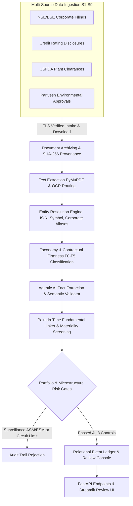

# Event-Driven Corporate Catalyst & Market Microstructure Engine

[](https://www.python.org/downloads/)
[](https://fastapi.tiangolo.com/)
[](https://www.sqlite.org/)
[](https://docs.pydantic.dev/)
[]()
[](LICENSE)

An institutional-grade, event-driven financial intelligence engine and corporate disclosure processing pipeline engineered for 2,300+ Indian corporate issuers (NSE/BSE). Ingests official exchange filings, credit rating announcements, USFDA inspection outcomes, and environmental regulatory clearances, using agentic AI document extraction and point-in-time fundamental validation to convert unstructured corporate news into structured, audit-ready data.

---

## Architecture & Pipeline Flow



---

## Key Financial & Technical Capabilities

### 1. Autonomous Regulatory & Exchange Ingestion
* **Live Exchange Polling**: Ingests corporate disclosures directly from the National Stock Exchange of India (NSE) via resilient HTTPS sessions with exponential backoff and rate-limit handling.
* **Document Archiving & Provenance**: Persists raw PDF attachments with SHA-256 cryptographic checksums, recording extraction quality states, HTTP status, and publication timestamps for a complete audit trail.

### 2. Entity Resolution & Security Master Mapping
* **Multi-Tier Identification**: Resolves corporate announcements to a canonical entity master tracking **2,300+ listed issuers** using exact ISIN lookup, symbol matching, corporate name normalization, and Levenshtein similarity.
* **Group & Parent-Subsidiary Relationships**: Navigates complex holding company and subsidiary relationships to map project contracts to their true listed beneficiaries.

### 3. Contractual Firmness & Event Taxonomy
* **28 Canonical Event Archetypes**: Normalizes disparate exchange disclosures into standardized categories (commercial order wins, multi-notch rating upgrades, USFDA EIR audit clearances, Capex expansions, and governance alerts).
* **Deterministic Contractual Firmness (F0–F5)**: Evaluates contractual enforceability using rule-based boundaries:
  * **F0–F2**: Market rumors, non-binding MoUs, and management intentions.
  * **F3**: Lowest-bidder (L1) declarations.
  * **F4**: Formal Letters of Award (LOA) and board approvals.
  * **F5**: Fully executed purchase orders and final regulatory clearances.
  * *Strict Safeguard: AI models are programmatically blocked from overriding rule-based firmness boundaries.*

### 4. Agentic AI Fact Extraction & Semantic Validation
* **Structured Information Extraction**: Uses LLM prompts with strict Pydantic v2 schemas to parse unstructured PDF text, extracting order values, counterparties, completion horizons, and debt rating notches.
* **Multi-Stage Semantic Validator**: Enforces rejection conditions preventing common extraction hallucinations (e.g., misreading foreign currency, missing baseline ratings, or non-actionable boilerplate disclosures).

### 5. Point-in-Time Fundamental Linker & Materiality Screening
* **True Point-in-Time Fundamentals**: Cross-references announcements against historical financial statements active on the announcement date.
* **Order Materiality Ratio**: Computes:
  $$\text{Materiality Ratio} = \frac{\text{Order Value (INR)}}{\text{TTM Revenue (INR)}}$$
  Filters out non-material contracts ($< 15\%$ of TTM revenue or $< \text{₹50 Crore}$) to eliminate headline noise.

### 6. Risk Gating & Surveillance Screening
* **Surveillance Exclusions**: Automatically excludes equities under regulatory watchlists (`ASM`, `GSM`, `ESM`, `T2T`).
* **Price Band Checks**: Rejects securities with tight circuit limits ($\le 2\%$ or $\le 5\%$) to avoid exit illiquidity.
* **Governance Blacklists**: Automatically applies an immediate exit signal and 20-session trading freeze upon forensic allegations, auditor resignations, or regulatory enforcement actions.

### 7. Review Console & FastAPI REST Service
* **FastAPI Service**: Provides production REST endpoints (`/health`, `/sources/health`, `/events`, `/strategies`, `/reports`).
* **Interactive Review Console**: Built in Streamlit, displaying side-by-side evidence views of raw PDF documents against extracted financial facts for manual compliance sign-off.

---

## Repository Structure

```text
├── src/qual_event_engine/
│   ├── sources/        # Source adapters (exchange, ratings, usfda, parivesh)
│   ├── ingestion/      # Document archiving, SHA-256 provenance, and PDF text extraction
│   ├── identity/       # Entity resolution, alias manager, and relationship graph
│   ├── events/         # Taxonomy mapping, firmness evaluator, dedup, and revisions
│   ├── intelligence/   # Agentic LLM extraction, prompt contracts, and semantic validator
│   ├── market/         # Point-in-time universe, liquidity screens, and surveillance filters
│   ├── normalization/  # Rating scales (1-20 ordinal), materiality, and lead-time algorithms
│   ├── decisions/      # Risk gates (8 portfolio controls) and state machine
│   ├── paper/          # Market microstructure simulator, statutory friction, and ledger
│   ├── persistence/    # SQLite WAL database management, DDL, and migrations
│   ├── api/            # FastAPI endpoints and service dependencies
│   ├── review_ui/      # Streamlit compliance review console
│   └── cli.py          # Unified command-line interface
├── configs/            # Source definitions, universe tiers, statutory costs, and strategies
├── scripts/            # Operations scripts, failure drills, release gates, and database backups
├── tests/              # Comprehensive test suite (unit, integration, and replay)
└── pyproject.toml      # Build metadata and dependency specifications
```

---

## Quick Start & Setup

### 1. Installation
```bash
git clone https://github.com/Hastagtamilnadu/event-driven-catalyst-engine.git
cd event-driven-catalyst-engine
uv sync --extra dev
```

### 2. Initialize the Ledger Database
```bash
uv run qual-engine initialise-db
```

### 3. Ingest Live Exchange Announcements
```bash
uv run qual-engine ingest --source exchange --mode LIVE_POLL
```

### 4. Process Events & Extract Structured Facts
```bash
uv run qual-engine process-events
```

### 5. Launch the Review API & Console
```bash
# Start FastAPI backend
uv run uvicorn qual_event_engine.api.app:app --host 127.0.0.1 --port 8765

# Start Streamlit Review UI
uv run streamlit run src/qual_event_engine/review_ui/Home.py
```

### 6. Run Test Suite
```bash
uv run pytest tests/unit tests/integration tests/replay
```

---

## Author & Contact

**P Ragul**  
* Master of Commerce (M.Com - Accounting & Finance), SRM University  
* Bachelor of Commerce (B.Com - Bank Management), Ramakrishna Mission Vivekananda College  
* Location: Chennai, Tamil Nadu, India  
* LinkedIn: [linkedin.com/in/ragul-accfin](https://www.linkedin.com/in/ragul-accfin)
