# Indian Corporate Disclosure & Catalyst Analysis Pipeline

[](https://www.python.org/downloads/)
[](https://www.sqlite.org/)
[]()
[](LICENSE)

A financial data analysis and corporate disclosure screening pipeline built for **Indian listed equities (NSE/BSE)**.

The project automates the collection and financial screening of corporate exchange announcements, credit rating agency releases (CRISIL, ICRA, CARE, India Ratings), USFDA inspection notices, and environmental clearances. Rather than treating every corporate headline as equal, the pipeline applies **accounting materiality thresholds, contractual enforceability grading (F0–F5), credit rating scale normalization, and SEBI surveillance filters** to separate material financial catalysts from routine corporate noise.

---

## Project Scope & Development Methodology

This project was built from an **Accounting & Financial Data Analysis** perspective, combining domain-driven financial research with AI-assisted Python development:

* **Financial Logic & Analytical Framework (Author-Designed):**
  * **Contractual Firmness Grading (F0–F5):** Designed the classification rules separating non-binding MoUs (`F1`) and provisional Lowest Bidder (`L1` / `F3`) announcements from signed Letters of Award (`F4`) and executed contracts (`F5`).
  * **Accounting Materiality Screening:** Defined the `Order Value / TTM Operating Revenue >= 15%` threshold (with a Rs. 50 Crore floor) to measure the actual financial impact of new order wins against historical quarterly income statements.
  * **Credit Rating Scale Mapping:** Constructed the 1-to-20 numerical conversion table (`D = 1` to `AAA = 20`) to standardize rating upgrades and downgrades across CRISIL, ICRA, CARE, and India Ratings.
  * **Market Microstructure & Surveillance Filters:** Specified screening rules for SEBI surveillance lists (`ASM`, `GSM`, `ESM`), narrow price circuit bands (`<= 5%`), and adverse governance events (auditor resignations, forensic audits).
* **Software Scaffolding & Automation (AI-Assisted):**
  * Used AI coding tools to translate these financial rules into a modular Python package, including the SQLite database schema, LLM text-extraction prompts, FastAPI/Streamlit viewer interfaces, and automated test cases.

---

## Analytical Pipeline Flow

```mermaid
flowchart LR
    S1["NSE / BSE Exchange Filings\n(Corporate Announcements)"]
    S2["Credit Rating Releases\n(CRISIL, ICRA, CARE, India Ratings)"]
    S3["Regulatory Filings\n(USFDA & Environmental Clearances)"]
    PARSE["PDF Text Extraction\n& Filing Archive"]

    RESOLV["Company Entity Matching\n(ISIN, NSE Ticker & Subsidiary Lookup)"]
    CAT["Event Categorization\n(Orders, Ratings, Capex, Governance)"]
    FIRM["Contractual Firmness Check\n(F0 Rumor to F5 Signed Contract)"]

    EXTRACT["Structured Data Extraction\n(Order Value, Counterparty, Rating Change)"]
    CHECK["Rule Validation\n(Verify Numbers & Currency Units)"]

    FIN["Quarterly Financials Lookup\n(Trailing 12-Month Revenue & PAT)"]
    MAT["Materiality Ratio Calculation\nOrder Value / TTM Revenue >= 15%"]
    RISK{"Surveillance & Risk Screen"}
    REJ["Filtered Out\n(Routine Order < 15% TTM or ASM/GSM Stock)"]

    DB[("SQLite Analysis Database\n(Structured Events & Ratios)")]
    OUT["Analytical Output\n(CSV Exports & Review Dashboard)"]

    S1 & S2 & S3 --> PARSE
    PARSE --> RESOLV --> CAT --> FIRM
    FIRM --> EXTRACT --> CHECK
    CHECK --> FIN --> MAT --> RISK
    RISK -->|"Fails Criteria"| REJ
    RISK -->|"Passes Materiality & Risk"| DB
    DB --> OUT

    subgraph STAGE1 ["1. Filing Collection"]
        S1
        S2
        S3
        PARSE
    end

    subgraph STAGE2 ["2. Company & Event Classification"]
        RESOLV
        CAT
        FIRM
    end

    subgraph STAGE3 ["3. Financial Figure Extraction"]
        EXTRACT
        CHECK
    end

    subgraph STAGE4 ["4. Materiality & Surveillance Screening"]
        FIN
        MAT
        RISK
        REJ
    end

    subgraph STAGE5 ["5. Database & Reporting"]
        DB
        OUT
    end

    style STAGE1 fill:none,stroke:#3b82f6,stroke-width:2px
    style STAGE2 fill:none,stroke:#8b5cf6,stroke-width:2px
    style STAGE3 fill:none,stroke:#10b981,stroke-width:2px
    style STAGE4 fill:none,stroke:#f59e0b,stroke-width:2px
    style STAGE5 fill:none,stroke:#06b6d4,stroke-width:2px
```



---

## Repository Structure

```
event-driven-catalyst-engine/
|
+-- configs/                            Financial Thresholds & Screening Rules
|   +-- sources.yaml                    Filing source configurations and polling intervals
|   +-- universe.yaml                   Market-cap and daily liquidity eligibility rules
|   +-- costs.yaml                      Indian statutory transaction fee schedule (STT, GST, SEBI)
|   +-- strategies.yaml                 Materiality ratio cutoffs and firmness thresholds
|
+-- src/qual_event_engine/              Core Python Package
|   |
|   +-- identity/                       Company & Subsidiary Lookup
|   |   +-- resolver.py                 Matches filings to NSE tickers and ISIN identifiers
|   |   +-- aliases.py                  Cleans corporate suffixes (Ltd, Pvt Ltd, India)
|   |   +-- relationships.py            Maps unlisted subsidiary/SPV orders to listed parent companies
|   |
|   +-- events/                         Event Classification & Firmness Rules
|   |   +-- taxonomy.py                 Categorizes filings (Order Wins, Credit Ratings, USFDA, Capex)
|   |   +-- firmness.py                 Applies F0-F5 legal enforceability scoring rules
|   |   +-- dedup.py                    Removes duplicate exchange announcements
|   |
|   +-- normalization/                  Financial Ratio & Rating Calculations
|   |   +-- algorithms.py               Order Materiality (Order/TTM Revenue) & 1-20 rating scale math
|   |
|   +-- market/                         Financial Statement & Universe Data
|   |   +-- fundamentals.py             Links announcements to historical quarterly revenue and PAT
|   |   +-- universe.py                 Checks daily traded turnover and SEBI ASM/GSM surveillance flags
|   |   +-- calendar.py                 NSE trading session and holiday calendar lookup
|   |
|   +-- intelligence/                   LLM Text Extraction Helpers
|   |   +-- extraction.py               Extracts contract values and rating changes from PDF text
|   |   +-- validator.py                Checks extracted numbers against source text and unit scales
|   |
|   +-- decisions/                      Screening & Portfolio Filter Logic
|   |   +-- risk_gates.py               Applies liquidity, sector exposure, and governance filters
|   |   +-- risk.py                     Flags adverse corporate events (auditor resignations, defaults)
|   |
|   +-- sources/                        Exchange & Regulatory Downloaders
|   |   +-- exchange.py                 Downloads daily corporate announcements from NSE
|   |
|   +-- persistence/                    SQLite Storage Layer
|   |   +-- database.py                 SQLite database connection and query helpers
|   |   +-- ddl.py                      Table schemas for filings, company financials, and events
|   |
|   +-- review_ui/                      Streamlit Inspection Interface
|   |   +-- Home.py                     Dashboard to review extracted figures alongside source PDFs
|   |
|   +-- cli.py                          Command-Line Runner (qual-engine)
|
+-- tests/                              Automated Verification Tests
|   +-- unit/                           Tests for materiality math, rating notch calculation, and F0-F5 rules
|   +-- integration/                    End-to-end filing processing tests
|   +-- fixtures/                       Sample corporate disclosures and financial test cases
|
+-- pyproject.toml                      Python dependencies and package setup
+-- LICENSE                             MIT License
+-- README.md                           Project documentation
```

---

## Core Financial Analysis Logic

### 1. Contractual Firmness Grading (F0–F5)
Corporate announcements in India frequently mix non-binding intentions with signed revenue contracts. To avoid acting on premature disclosures, every order/contract filing is graded on a 6-level scale:

| Grade | Classification | Financial & Legal Meaning |
|-------|---------------|---------------------------|
| **F0** | Rumor / Media | Unconfirmed press reports without exchange confirmation |
| **F1** | Intention / MoU | Non-binding Memorandum of Understanding or management guidance |
| **F2** | Pre-Qualification | Technically qualified for tender bidding; no commercial win |
| **F3** | Lowest Bidder (L1) | Declared L1 bidder in a tender, but formal Letter of Award is still pending |
| **F4** | Binding Award (LOA) | Official Letter of Award received or board-approved transaction |
| **F5** | Signed Contract | Definitive commercial agreement executed or final regulatory clearance |

*Rule Enforcement:* An AI extraction step cannot upgrade a filing's firmness grade unless the deterministic legal keywords (such as "Letter of Award" or "Work Order") are present in the filing text.

### 2. Order Book Materiality Ratio
A Rs. 100 Crore order is transformative for a small-cap engineering firm with Rs. 300 Crore in annual sales, but immaterial for a large-cap conglomerate. Each order win is compared against the company's **Trailing 12-Month (TTM) Operating Revenue** as of the announcement date:

$$\text{Order Materiality Ratio} = \frac{\text{Awarded Order Value (INR)}}{\text{TTM Operating Revenue (INR)}}$$

- **Materiality Cutoff:** Orders below **15% of TTM revenue** (or below **Rs. 50 Crore** absolute value) are filtered out as routine business operations.
- **Point-in-Time Matching:** Uses the quarterly financial results already published prior to the filing date to avoid look-ahead bias in historical analysis.

### 3. Credit Rating Standardization (1–20 Scale)
Indian credit rating agencies (CRISIL, ICRA, CARE, India Ratings) publish ratings using alphanumeric symbols (`BBB-`, `A+`, `AA`, etc.). The pipeline maps these symbols onto a uniform **1 to 20 ordinal scale** (`D = 1` up to `AAA = 20`) to compute exact notch changes:
- Example: An upgrade from `CRISIL A` (14) to `CRISIL A+` (15) is recorded as a `+1.0 notch` improvement, enabling quantitative comparison across agencies and sectors.

### 4. Subsidiary & SPV Beneficiary Mapping
Infrastructure and capital goods companies often win contracts through unlisted Special Purpose Vehicles (SPVs) or wholly-owned subsidiaries. The entity lookup module maps subsidiary names back to the listed NSE parent company so that material subsidiary orders are properly attributed to the parent's consolidated revenue base.

### 5. SEBI Surveillance & Microstructure Filters
Even when a corporate catalyst is financially material, market microstructure constraints can make a stock uninvestable. The screening logic excludes:
- Securities under SEBI **ASM (Additional Surveillance Measure)**, **GSM (Graded Surveillance Measure)**, or **ESM**.
- Securities restricted to narrow daily price circuit bands (**2% or 5%**), where liquidity dries up during price moves.
- Companies with recent adverse governance filings (auditor resignations, forensic audits, or debt defaults).

---

## Quick Start

### 1. Setup Environment
```bash
git clone https://github.com/Hastagtamilnadu/event-driven-catalyst-engine.git
cd event-driven-catalyst-engine
uv sync --extra dev
```

### 2. Initialize SQLite Database
```bash
uv run qual-engine initialise-db
```

### 3. Run Filing Ingestion & Screening
```bash
uv run qual-engine ingest --source exchange --mode LIVE_POLL
uv run qual-engine process-events
```

### 4. Run Tests
```bash
uv run pytest tests/unit tests/integration
```

---

## Author

**P Ragul**
- Master of Commerce (M.Com — Accounting & Finance), SRM University
- Bachelor of Commerce (B.Com — Bank Management), Ramakrishna Mission Vivekananda College
- LinkedIn: [linkedin.com/in/ragul-accfin](https://www.linkedin.com/in/ragul-accfin)
