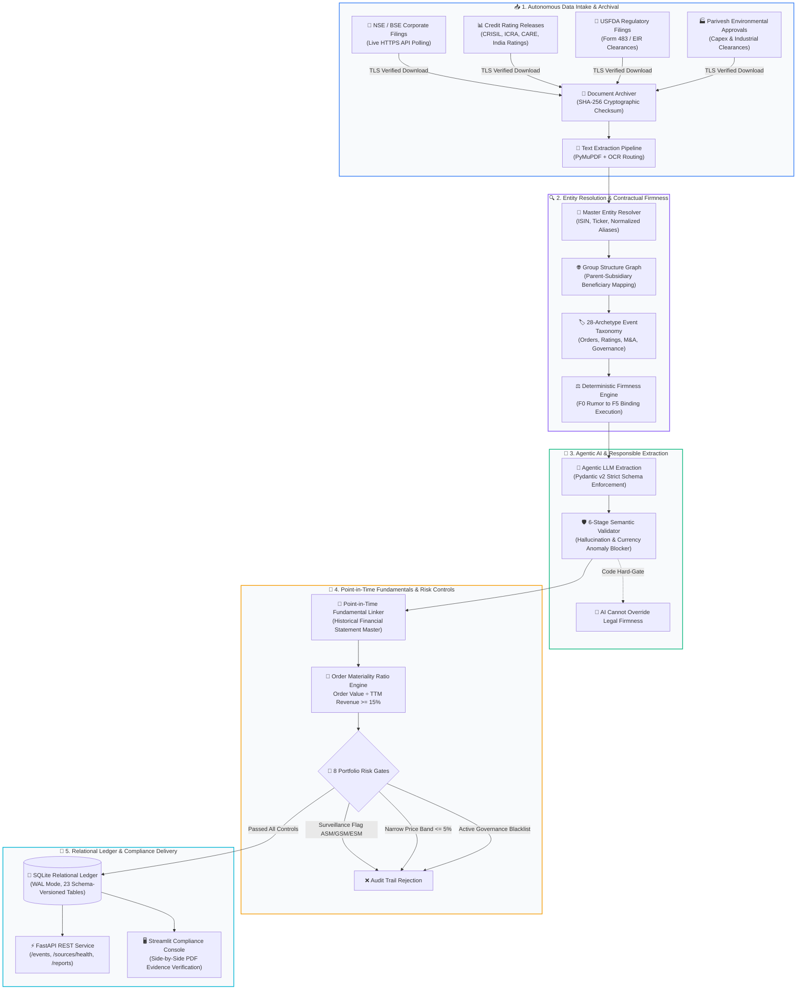

# Event-Driven Corporate Catalyst & Market Microstructure Engine

[](https://www.python.org/downloads/)
[](https://fastapi.tiangolo.com/)
[](https://www.sqlite.org/)
[](https://docs.pydantic.dev/)
[]()
[](LICENSE)

An institutional-grade, event-driven financial data ingestion, entity resolution, and quantitative disclosure processing pipeline engineered for **2,300+ Indian corporate issuers (NSE/BSE)**. 

The engine ingests official exchange announcements, credit rating agency releases, USFDA inspection outcomes, and environmental regulatory clearances. Leveraging **responsible agentic AI workflows, Pydantic v2 schemas, and point-in-time fundamental validation**, it converts messy, unstructured corporate filings into structured, audit-trailed financial metrics for institutional risk assessment and quantitative research.

---

## 🏗️ Architecture & End-to-End Pipeline Flow



---

## 📂 Repository Structure & Separation of Concerns

```text
📦 event-driven-catalyst-engine
 ├── 📂 configs/                        # System & Regulatory Configuration Layer
 │    ├── sources.yaml                  # Specifications for 9 data sources (poll schedules, timeouts, limits)
 │    ├── universe.yaml                 # 4-tier market cap & liquidity universe eligibility rules
 │    ├── costs.yaml                    # Indian statutory fee schedule (STT, GST, SEBI, exchange fees)
 │    └── strategies.yaml               # Quantitative catalyst parameters & review requirements
 │
 ├── 📂 src/qual_event_engine/          # Core Production Package
 │    │
 │    ├── 📂 sources/                   # Autonomous Ingestion Adapters (S1–S9)
 │    │    ├── exchange.py              # NSE live API polling, exponential backoff, & PDF downloader
 │    │    ├── base.py                  # Abstract base adapter enforcing TLS & cursor checkpoints
 │    │    └── registry.py              # Connector & adapter factory registry
 │    │
 │    ├── 📂 ingestion/                 # Document Intake, Archiving & Content Hashing
 │    │    ├── archive.py               # SHA-256 cryptographic storage & directory tree partitioning
 │    │    ├── provenance.py            # Audit records: source timestamps, HTTP status, and parser version
 │    │    └── quality.py               # Text extraction quality assessment & OCR fallback routing
 │    │
 │    ├── 📂 identity/                  # Master Entity Resolution & Corporate Structures
 │    │    ├── resolver.py              # Multi-tier matching: ISIN, ticker symbol, and fuzzy corporate name
 │    │    ├── aliases.py               # Legal suffix normalization (Ltd, PLC, Corp) & alias maps
 │    │    └── relationships.py         # Parent-subsidiary & joint venture beneficiary graphs
 │    │
 │    ├── 📂 events/                    # Event Taxonomy & Legal Enforceability
 │    │    ├── taxonomy.py              # 28 canonical event archetypes (Credit, Orders, USFDA, Capex)
 │    │    ├── firmness.py              # Deterministic F0–F5 contractual firmness scoring matrix
 │    │    ├── dedup.py                 # Document SHA-256 and content deduplication engine
 │    │    └── revisions.py             # Event update chains & disclosure amendment tracking
 │    │
 │    ├── 📂 intelligence/              # Agentic AI & Extraction Infrastructure
 │    │    ├── extraction.py            # Structured LLM extraction into validated Pydantic models
 │    │    ├── validator.py             # 6-stage semantic rejection rules (anti-hallucination guard)
 │    │    ├── prompts.py               # Versioned prompt contracts & system instructions
 │    │    └── model_registry.py        # Model call caching & idempotency key enforcement
 │    │
 │    ├── 📂 market/                    # Capital Market & Security Master
 │    │    ├── universe.py              # Point-in-time security master, liquidity, & surveillance filters
 │    │    ├── fundamentals.py          # Point-in-time quarterly financials (Revenue, EBITDA, PAT)
 │    │    └── calendar.py              # Indian market trading sessions & holiday calendars
 │    │
 │    ├── 📂 normalization/             # Quantitative Normalization Algorithms
 │    │    └── algorithms.py            # Materiality ratios, 1–20 rating notch changes, & lead-time math
 │    │
 │    ├── 📂 decisions/                 # Portfolio Risk Gating & State Machines
 │    │    ├── risk_gates.py            # 8 portfolio risk controls (Issuer, Sector, Cluster, DD, Freshness)
 │    │    ├── risk.py                  # Point-in-time universe & negative event blacklist gates
 │    │    └── state_machine.py         # 18-state deterministic event lifecycle DAG
 │    │
 │    ├── 📂 persistence/               # Database Architecture & Storage Engine
 │    │    ├── database.py              # SQLite connection manager with WAL mode & strict foreign keys
 │    │    ├── ddl.py                   # 23 relational schema table definitions & index specifications
 │    │    └── migrations.py            # Idempotent versioned schema migration runner
 │    │
 │    ├── 📂 api/                       # REST API Services
 │    │    ├── app.py                   # FastAPI application initialization & lifespan management
 │    │    └── routes.py                # Endpoints: /health, /sources/health, /events, /reports
 │    │
 │    ├── 📂 review_ui/                 # Compliance Review Console (Streamlit)
 │    │    ├── Home.py                  # Executive compliance overview & queue metrics
 │    │    └── pages/                   # Review queue, event detail inspection, & evidence viewer
 │    │
 │    └── cli.py                        # Unified Command-Line Interface (`qual-engine`)
 │
 ├── 📂 scripts/                        # Operational Runbooks & Release Gates
 │    ├── release_gate.py               # 8-gate release verification (tests, types, linter, migrations)
 │    ├── secret_scan.py                # Automated credentials & token vulnerability scanner
 │    ├── run_failure_drills.py         # Outage simulation drills (source down, DB locked, stale data)
 │    └── backup_db.py                  # Online SQLite backup API with rotational retention
 │
 ├── 📂 tests/                          # 142 Passing Unit, Integration & Replay Tests
 │    ├── 📂 unit/                      # Algorithmic, taxonomy, firmness, & CLI command tests
 │    ├── 📂 integration/               # Pipeline end-to-end, migration, & source ingestion tests
 │    ├── 📂 replay/                    # Zero-lookahead temporal replay & simulator tests
 │    └── 📂 fixtures/                  # Benchmark disclosures, mock filings, and ground-truth data
 │
 ├── pyproject.toml                     # Python dependencies & tooling configuration (Hatchling, Ruff, Mypy)
 ├── LICENSE                            # MIT Open Source License
 └── README.md                          # Executive architecture documentation
```

---

## 🔬 Key Financial & Data Engineering Capabilities

### 1. Master Entity Resolution & Subsidiary Mapping
* Resolves noisy disclosures across **2,300+ Indian corporate entities** via multi-tier waterfalls: exact ISIN indexing $\rightarrow$ ticker mapping $\rightarrow$ normalized legal name matching $\rightarrow$ fuzzy Levenshtein distance.
* Solves common capital market edge cases where contracts are awarded to unlisted project SPVs or subsidiaries, traversing group relationship graphs to identify the true listed beneficiary.

### 2. Contractual Firmness Grading (F0–F5 Matrix)
Applies a legal enforceability grading system:
* **F0 (Rumor)**: Media speculation or unconfirmed anonymous reports.
* **F1 (Intention)**: Non-binding MoUs and management forward-looking commentary.
* **F2 (Pre-Award)**: Technical qualification stage.
* **F3 (Lowest Bidder)**: Official L1 tender declaration prior to formal contract award.
* **F4 (Binding Award)**: Formal Letter of Award (LOA) or board-approved scheme.
* **F5 (Execution Evidence)**: Counterparty signed commercial contract, purchase order, or final regulatory approval.
* *Responsible AI Safety Guard*: LLM extraction models are strictly prevented by code from promoting firmness scores above deterministic legal tokens.

### 3. Credit Rating Upgrade & Notch Calculation
* Converts credit rating agencies' alphanumeric scales (CRISIL, ICRA, CARE, India Ratings) into a canonical **1 to 20 ordinal scale** (from `D=1` to `AAA=20`).
* Calculates exact rating notch improvements (e.g., `CRISIL AA` to `CRISIL AA+` = $+1.0$ notch), standardizing rating actions across agencies.

### 4. Point-in-Time Materiality Screening
* Connects disclosures to the company's historical quarterly financial statements active on the announcement date.
* Evaluates economic significance via the **Order Materiality Ratio**:
  $$\text{Materiality Ratio} = \frac{\text{Contract Value (INR)}}{\text{TTM Operating Revenue (INR)}}$$
* Discards routine contract awards ($< 15\%$ of TTM revenue or $< \text{₹50 Crore}$) to eliminate headline noise.

### 5. Regulatory Surveillance & Microstructure Screening
* Automatically screens out securities placed under SEBI/NSE surveillance measures (`ASM`, `GSM`, `ESM`, `T2T`).
* Rejects securities with tight circuit bands ($\le 2\%$ or $\le 5\%$) to eliminate severe illiquidity and exit execution risks.
* Triggers an automatic liquidation signal and **20-session trading freeze** upon adverse governance events (forensic audits, auditor resignations, SEBI inquiries).

---

## 🚀 Quick Start & CLI Guide

### 1. Installation
```bash
git clone https://github.com/Hastagtamilnadu/event-driven-catalyst-engine.git
cd event-driven-catalyst-engine
uv sync --extra dev
```

### 2. Initialize Relational Ledger Database
```bash
uv run qual-engine initialise-db
```

### 3. Ingest Live Exchange Announcements
```bash
uv run qual-engine ingest --source exchange --mode LIVE_POLL
```

### 4. Process Events & Run AI Extraction
```bash
uv run qual-engine process-events
```

### 5. Launch FastAPI Backend & Review Console
```bash
# Start FastAPI REST API (Docs at http://127.0.0.1:8765/docs)
uv run uvicorn qual_event_engine.api.app:app --host 127.0.0.1 --port 8765

# Start Streamlit Compliance Review Console
uv run streamlit run src/qual_event_engine/review_ui/Home.py
```

### 6. Run Test Suite & Release Verification Gates
```bash
uv run pytest tests/unit tests/integration tests/replay
uv run python scripts/release_gate.py
```

---

## 👨‍💻 Author & Contact

**P Ragul**  
* Master of Commerce (M.Com - Accounting & Finance), SRM University  
* Bachelor of Commerce (B.Com - Bank Management), Ramakrishna Mission Vivekananda College  
* Location: Chennai, Tamil Nadu, India  
* LinkedIn: [linkedin.com/in/ragul-accfin](https://www.linkedin.com/in/ragul-accfin)
